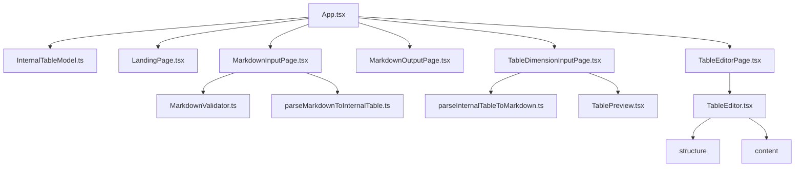
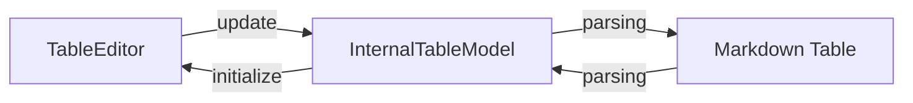
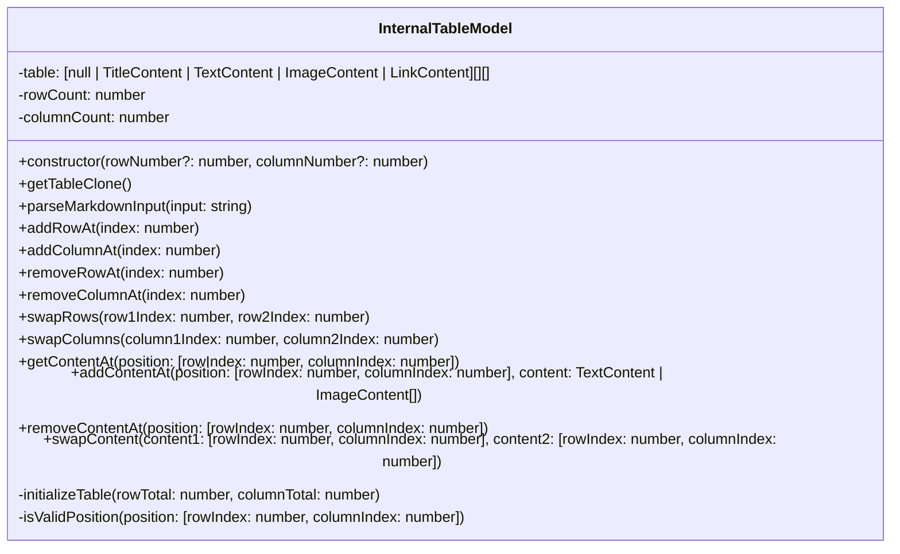
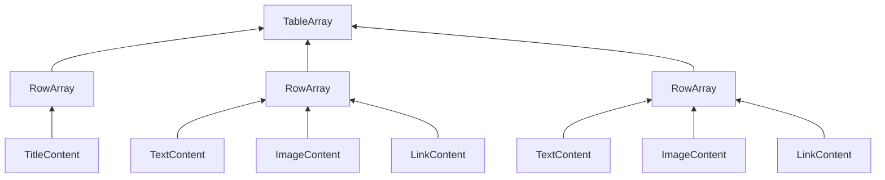

# **Documentation**
<br>
<br>

## **Table Of Contents**
<br>

- [**Documentation**](#documentation)
  - [**Table Of Contents**](#table-of-contents)
  - [**Requirements**](#requirements)
    - [**Wireframe**](#wireframe)
    - [**Use Case Diagram**](#use-case-diagram)
  - [**Implementation**](#implementation)
    - [**Overview**](#overview)
    - [**Internal Table Model**](#internal-table-model)
      - [**Class Diagram**](#class-diagram)
      - [**Internal Table Representation**](#internal-table-representation)
      - [**Types**](#types)
        - [**TitleContent**](#titlecontent)
        - [**TextContent**](#textcontent)
        - [**ImageContent**](#imagecontent)
        - [**ColumnAlignmentOption**](#columnalignmentoption)
        - [**LinkTargetOption**](#linktargetoption)

<br>
<br>
<br>
<br>

## **Requirements**
<br>
<br>
<br> 

### **Wireframe**
<br>


<br>
<br>
<br>

### **Use Case Diagram**
<br>


<br>
<br>
<br>
<br>

## **Implementation**
<br>
<br>
<br>

### **Overview**
<br>





**Table Data Flow:**


<br>
<br>
<br>

### **Internal Table Model**
<br>
<br>

#### **Class Diagram**
<br>



<br>
<br>
<br>

#### **Internal Table Representation**
<br>

The table is internally represented as a zero based two-dimensional array.

<br>



<br>

The first row array holds references to [TitleContent](#titlecontent) objects.

All subsequent arrays can hold references to either [TextContent](#textcontent), [ImageContent](#imagecontent) or [LinkContent](#linkcontent) objects. Empty cells are represented by _Null_ reference.

<br>
<br>

Example:

<br>

|Index |0            |1            |2            |3            |
|:----:|:-----------:|:-----------:|:-----------:|:-----------:|
|0     |TitleContent |TitleContent |TitleContent |TitleContent |
|1     |TextContent  |Null         |ImageContent |Null         |
|2     |Null         |Null         |Null         |TextContent  |

<br>
<br>
<br>

#### **Types**
<br>
<br>

##### **TitleContent**
<br>

```typescript
type TitleContent = {
   type: 'title',
   title: string,
   columnAlignment: ColumnAlignmentOption
};
```

<br>
<br>

##### **TextContent**
<br>

```typescript
type TextContent = {
   type: 'text',
   text: string,
   isLink: boolean,
   href: string,
   target: LinkTargetOption,
   title: string
};
```

<br>
<br>

##### **ImageContent**
<br>

```typescript
type ImageContent = {
   type: 'image',
   src: string,
   alt: string,
   width: string,
   height: string,
   title: string,
   isLink: boolean,
   href: string,
   target: LinkTargetOption
};
```

<br>
<br>

##### **ColumnAlignmentOption**
<br>

```typescript
type ColumnAlignmentOption = 'left' | 'right' | 'center';
```

<br>
<br>

##### **LinkTargetOption**
<br>

```typescript
type LinkTargetOption = '_blank' | '_parent' | '';
```