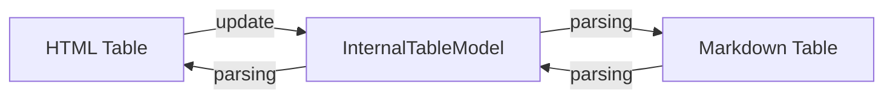
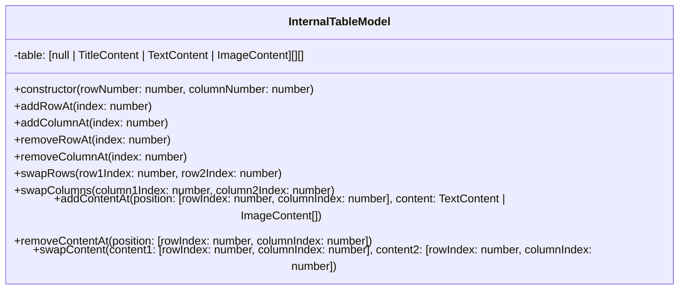
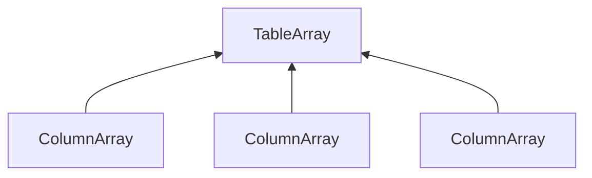

# **Documentation**
<br>
<br>

## **Table Of Contents**
<br>

- [**Documentation**](#documentation)
  - [**Table Of Contents**](#table-of-contents)
  - [**Requirements**](#requirements)
    - [**Wireframe**](#wireframe)
    - [**Use Case Diagram**](#use-case-diagram)
  - [**Implementation**](#implementation)
    - [**Table Representations**](#table-representations)
      - [**Internal Table Model**](#internal-table-model)
        - [**Class Diagram**](#class-diagram)
        - [**Internal Table Representation**](#internal-table-representation)
        - [**Types**](#types)
          - [**TitleContent**](#titlecontent)
          - [**TextContent**](#textcontent)
          - [**ImageContent**](#imagecontent)

<br>
<br>
<br>
<br>

## **Requirements**
<br>
<br>
<br> 

### **Wireframe**
<br>


<br>
<br>
<br>

### **Use Case Diagram**
<br>


<br>
<br>
<br>
<br>

## **Implementation**
<br>
<br>
<br> 

### **Table Representations**
<br>



<br>
<br>
<br> 

#### **Internal Table Model**
<br>
<br>

##### **Class Diagram**
<br>



<br>
<br>
<br>

##### **Internal Table Representation**
<br>

The table is internally represented as a zero based two-dimensional array.

<br>



<br>

The first row holds references to [TitleContent](#titlecontent) objects.

All subsequent rows can hold references to either [TextContent](#textcontent) or [ImageContent](#imagecontent) objects. Empty cells are represented by _Null_ reference.

<br>

|   |0            |1            |2            |3            |
|:-:|:-----------:|:-----------:|:-----------:|:-----------:|
|0  |TitleContent |TitleContent |TitleContent |TitleContent |
|1  |TextContent  |Null         |ImageContent |Null         |
|2  |Null         |Null         |Null         |TextContent  |

<br>
<br>
<br>

##### **Types**
<br>
<br>

###### **TitleContent**
<br>

```typescript
type TitleContent = {
    title: string,
    columnAlignment: "left" | "right" | "center"
}
```

<br>
<br>

###### **TextContent**
<br>

```typescript
type TextContent = {
    text: string,
    href: string,
    target: "_blank" | "_parent"
}
```

<br>
<br>

###### **ImageContent**
<br>

```typescript
type ImageContent =  {
    src: string,
    alt: string,
    width: string,
    heigh: string,
    href: string,
    target: "_blank" | "_parent"
}
```