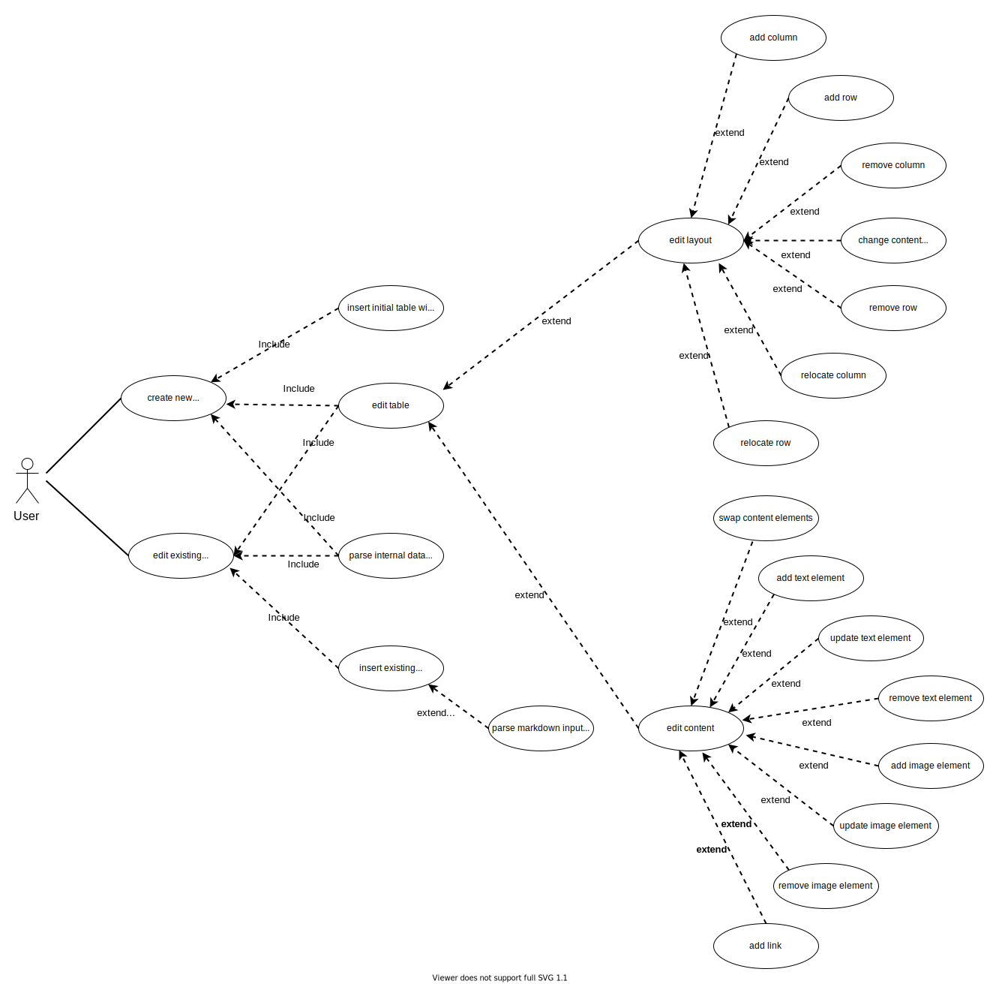

# **Documentation**
 
 

## **Table Of Contents**
 

- [**Documentation**](#documentation)
  - [**Table Of Contents**](#table-of-contents)
  - [**Wireframe**](#wireframe)
  - [**Use Case Diagram**](#use-case-diagram)

 
 
 

## **Wireframe**
 

 
 
 

## **Use Case Diagram**
 

